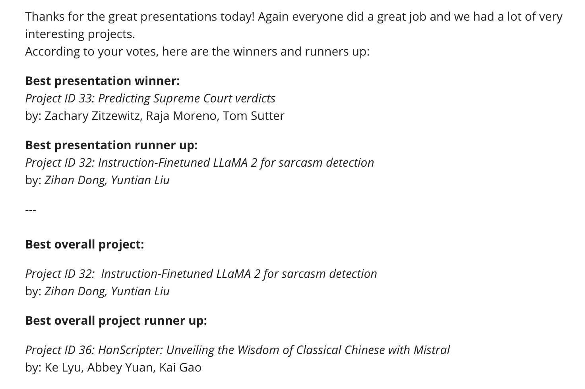

# Llama3-8-Bing: LLMs and Sarcasm

This repository serves for the final project of Yale CPSC 477/577 24 Spring. 


<p align="center">
  
</p>
---

##  Table of Contents
- [Data generation](#data-generation)
    
- [Model fine-tune](#model-fine-tune)
    - [Supervised finetuning for sarcasm classification](#supervised-finetuning-for-sarcasm-classification)
    - [Alignment for sarcastic chatbot](#yale-hpc-user)
- [Result and evaluation](#result-and-evaluation)


## Data generation
* The original data used for fine-tuning the model is from Friends TV series screenplay script. The dataset can be found [here](https://huggingface.co/datasets/blessondensil294/friends-tv-series-screenplay-script). This Dataset contains the text file of all the Screenplay Scripts and Dialogue for each episode in the FRIENDS TV Show.
* The data is preprocessed with the following steps:
    * Using the `data_raw_collect.ipynb`,  the riginal .txt data is read and converted to a jsonl file `friends_screenplay.jsonl` with the following format，each line is a json object that contains the episode id, title, and screenplay for each episode.
        ```json
        {"id": "S01E01", "title": "Monica Gets A Roommate", "screenplay": "The One Where Monica Gets a New Roommate (The Pilot-The Uncut Version)\nWritten by: Marta Kauffman & David Crane\n\n\n[Scene: Central Perk, Chandler, Joey, Phoebe, and Monica are there.]\n\nMonica: There's nothing to tell! He's just some guy I work with!\n\nJoey: C'mon, you're going out with the guy!..."}
        {"id": "S01E02", "title": "The Sonogram At The End", "screenplay": "The One With the Sonogram at the End\nWritten by: Marta Kauffman & David Crane\n\n\n[Scene Central Perk, everyone's there.]\n\nMonica: What you guys don't understand is, for us, kissing is as important as any part of it.\n\nJoey: Yeah, right!..."}
        ```
    * Using the `data_generate_gpt4.ipynb` to read the aforementioned.jsonl data and access `OpenAI API`, provide latest `GPT4-turbo`  with the screenplay of friends one episode at a time, prompt it to extract every Chandlers quote in that episode; for each Chandler’s line, summarize the context, determine if the line is sarcastic, provide the reasoning, and then generate hypothetical responses that can be later used as preference data. **Note it takes a couple of hours to generate data for all seasons and the total cost may add up to 30**. The generated data is saved in the format of jsonl file `chandler_bing_sarcasm_analysis_all_seasons.jsonl` with the following format:
        ```json
        {
            "Chandler_quote": "Original line from Chandler Bing",
            "Context": "Brief summary of the context around the quote",
            "Sarcasm": "True/False",
            "Reason": "Explanation for the sarcasm classification",
            "Unlike_chandler_sarcastic": "Hypothetical sarcastic response unlikely to be said by Chandler Bing",
            "Unlike_chandler_sincere": "Hypothetical sincere response unlikely to be said by Chandler Bing"
        }        
        ```
    * Using the `data_process_upload.ipynb` to process the original augmented data into the format of `instruction`, `chat`, and `preference data`, and upload them huggingface hub. The data can be found at [yl2342/friends_chandler_bing_sarcasm](https://huggingface.co/datasets/yl2342/friends_chandler_bing_sarcasm).


## Model fine-tune


### Supervised finetuning for sarcasm classification
* Supervised Fine Tuning (SFT) and Instruction Fine Tuning (IFT) of different SOTA LLMs on the sarcasm classification task of a public available dataset: https://github.com/EducationalTestingService/sarcasm/tree/master. The following scripts under the `SFT_classification` folder explain the function of each python coding file:
    * finetune_higgingface.ipynb: SFT of BERT and Llama2-7B model via huggingface.
    * gpt4_IFT.ipynb: IFT of gpt-3.5-turbo and gpt-4-turbo via openAI api.

### Alignment for sarcastic chatbot
* The base model we used is Llama 3 8B, the model information can be found [here](https://llama.meta.com/llama3/) and model can be accees through [huggingface](https://huggingface.co/meta-llama/Meta-Llama-3-8B).
* With the augumented preference data generated by GPT-4, we aim to enhance the alignment of Language Model outputs with the nuanced sarcasm expertise epitomized by Chandler Bing. To achieve this objective, we fine-tune three chat models based on a 4bit-quantized version using recent alignment techniques: 
    * Instruction Fine-tuning (IFT). Finetuned model upload to [llama3-8bing-sft](https://huggingface.co/yl2342/llama3-8bing-sft): 
    * Direct Policy Optimization (DPO). Finetuned model upload to[llama3-8bing-dpo](https://huggingface.co/yl2342/llama3-8bing-dpo)
    * and Odds Ratio Preference Optimization (ORPO). Finetuned model upload to [yl2342/llama3-8bing-orpo](https://huggingface.co/yl2342/llama3-8bing-orpo)

Each of these models was fine-tuned on the augmented dataset for one epoch using QLoRA. The models were trained using a single A100 GPU on colab notebook. Training script can be found in the `finetune_chatbot` folder. 


## Result and evaluation
* **Evaluation is still in progress**
We are still actively working on improving the models and identify the best way for evaluation of the models. Futher evaluation script can be found in the `evaluation` folder.
* **Final reprot**
We will post our final report in the `report` folder shortly after we fully finish the project and receive the final grade.
* **Voted best overall project**
We are honored to be voted as the overall best project in the class (session 2). We are grateful for the recognition and support from the professor and classmates. We will continue to work on this project and make it better.

<p align="center">
  
</p>


* **Some demo (from model llama3-8bing-sft)**


